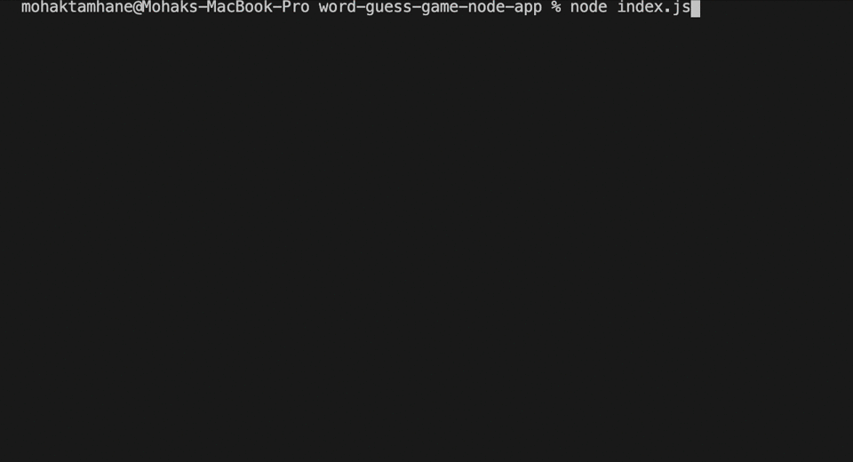

# Word Guess Game

A Node.js command line hangman game application that takes in inputs from keyboard and returns with a response if the user guessed correct letter or word.

## Installation

Use the node package manager to install dependencies.

```bash
npm install 
```
#### Packages used:
1. inquirer
2. chalk

## How to Run:

```bash
node index.js 
```
Follow the propmt on terminal.

## Contributing
Pull requests are welcome. For major changes, please open an issue first to discuss what you would like to change.

Please make sure to update tests as appropriate.

## Author
Mohak Tamhane
